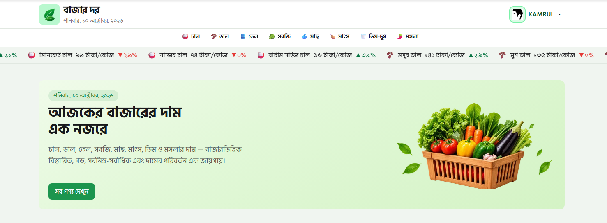

<div align="center">


# <a></a>

|  | <a  style="font-size: 42px; ">বাজার দর</a> |
| -------------------------------------------------------- | ------------------------------------------ |

### Know the Price. Shop with Confidence.

**A modern Bangla market price platform that helps people explore daily product prices and track market changes at a glance.**

<br/>

<a href="#-features">
  
</a>
<a href="#-tech-stack">
  
</a>
<a href="#-getting-started">
  
</a>

</div>

---

<!-- Custom SVG Hero Banner -->
<div align="center">
  
</div>

## 📖 About the Project

**Bazar-Dor** is a modern web application designed to make everyday market prices easier to explore and understand.

With a clean interface, Bangla product information, and dedicated price-change sections, users can quickly discover which products have increased or decreased in price and browse the broader product catalog.

The project combines a responsive frontend with API-driven product data to deliver a smooth, accessible, and informative browsing experience.

> **Our vision:** Make daily market price information simple, accessible, and understandable for everyone.

## ✨ Features

<table>
  <tr>
    <td width="50%">
      <h3>📈 Price Increase Tracking</h3>
      Explore products whose prices have increased and understand recent market changes.
    </td>
    <td width="50%">
      <h3>📉 Price Decrease Tracking</h3>
      Quickly identify products with decreasing prices.
    </td>
  </tr>
  <tr>
    <td width="50%">
      <h3>🛒 Product Catalog</h3>
      Browse available products with names, categories, images, units, and pricing information.
    </td>
    <td width="50%">
      <h3>🇧🇩 Bangla-First Experience</h3>
      Display product information and formatted prices for Bangla-speaking users.
    </td>
  </tr>
  <tr>
    <td width="50%">
      <h3>🔄 API-Driven Data</h3>
      Retrieve market product data from a dedicated API endpoint.
    </td>
    <td width="50%">
      <h3>📱 Responsive Interface</h3>
      Build a clean browsing experience for desktop, tablet, and mobile screens.
    </td>
  </tr>
</table>

## 🎨 Design Highlights

- **Fresh green identity** inspired by markets, produce, and everyday shopping.
- **Minimal, modern layout** focused on readability and useful information.
- **Reusable product cards** for consistent product presentation.
- **Clear price-change indicators** to distinguish upward and downward movements.
- **Bangla-friendly formatting** for a more familiar local experience.

## 🧰 Tech Stack

<div align="center">

|                                                      Technology                                                      | Purpose                                 |
| :------------------------------------------------------------------------------------------------------------------: | --------------------------------------- |
|                | React framework and application routing |
|       | Type safety and maintainable code       |
|  | Utility-first styling                   |
|               | Prebuilt UI components and styling      |
|           | External product data integration       |
|             | Interface icons, where used             |

</div>

## 🔌 Data Source

Product information is fetched from the following API:

```text
GET https://api.api-store.workers.dev/api/bazardor/products
```

The API provides product information such as:

- Product name in Bangla
- Product category and category icon
- Unit and product image
- Today's price and previous prices
- Price movement direction and percentage

The application uses this data to organize products into price-increase, price-decrease, and all-products sections.

## 🚀 Getting Started

Follow these steps to run the project locally.

### Prerequisites

Make sure you have installed:

- [Node.js](https://nodejs.org/) — a compatible version for your Next.js project
- npm, which comes with Node.js
- Git

### 1. Clone the Repository

```bash
git clone <your-github-repository-url>
cd <your-project-folder>
```

Replace the placeholders with your actual repository URL and project folder name.

### 2. Install Dependencies

```bash
npm install
```

### 3. Start the Development Server

```bash
npm run dev
```

### 4. Open the Application

Visit the following address in your browser:

```text
http://localhost:3000
```

## 📂 Project Structure

The following is an example structure based on the described application. Adjust it to match your actual files.

```text
bazar-dor/
├── public/
│   └── images/
├── src/
│   ├── app/
│   │   ├── layout.tsx
│   │   ├── page.tsx
│   │   └── globals.css
│   ├── components/
│   │   ├── Header.tsx
│   │   ├── ProductCard.tsx
│   │   └── ...
│   ├── lib/
│   │   └── getProducts.ts
│   └── types/
│       └── product.ts
├── package.json
├── tsconfig.json
└── README.md
```

## 🧩 Core Application Sections

| Section        | Description                                       |
| -------------- | ------------------------------------------------- |
| Hero Banner    | Introduces the platform and its purpose           |
| Price Increase | Highlights products with upward price movements   |
| Price Decrease | Highlights products with downward price movements |
| All Products   | Displays the wider product catalog                |
| Product Card   | Reusable UI for product details and pricing       |

## 🛠️ Available Scripts

Run the scripts configured in your `package.json`.

| Command         | Purpose                                  |
| --------------- | ---------------------------------------- |
| `npm run dev`   | Start the local development server       |
| `npm run build` | Create a production build                |
| `npm run start` | Run the production server after building |
| `npm run lint`  | Run lint checks, if configured           |

<!-- ## 🔮 Future Improvements

- [ ] Product search and category filters
- [ ] Historical price charts
- [ ] Price comparison across different dates
- [ ] Improved loading, empty, and error states
- [ ] More accessibility and performance improvements
- [ ] User notifications for significant price changes -->

<!-- ## 🤝 Contributing

Contributions, ideas, and feedback are welcome.

1. Fork this repository.
2. Create a feature branch.
3. Commit your changes.
4. Open a pull request with a clear description.

Please ensure your changes follow the project's existing coding conventions. -->

## 👨‍💻 Author

**Kamrul Islam**

Full-Stack Developer in progress · React · Next.js · TypeScript

- GitHub: [Your GitHub Profile](https://github.com/)
- LinkedIn: [Connect on LinkedIn](https://www.linkedin.com/in/kamruliislam/)

---

<div align="center">

|  | <a  style="font-size: 16px; ">বাজার দর</a> |
| -------------------------------------------------------- | ------------------------------------------ |

**Making market prices easier to understand.**

_Built with care for a better everyday shopping experience._

</div>
